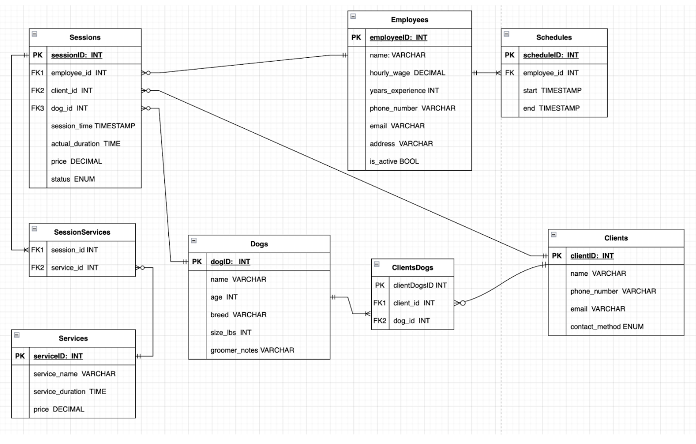
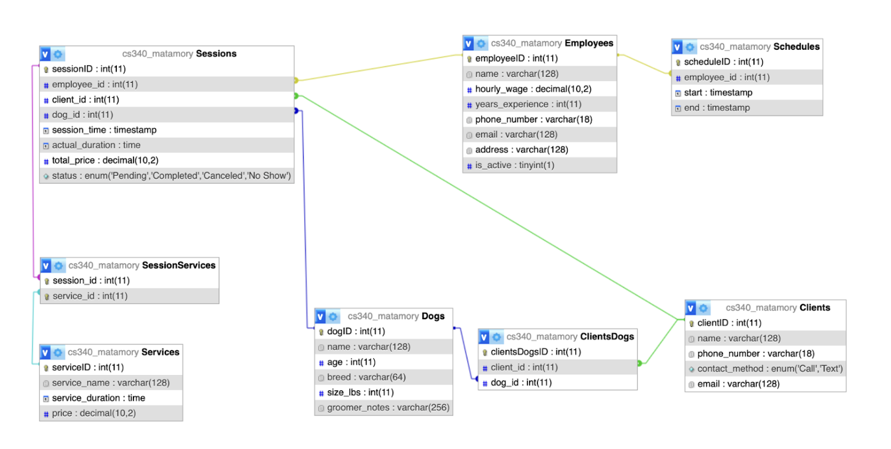

# SnoopysSnazzyStyles

Overview

Snoopy’s Snazzy Styles is a medium scale dog grooming company in need of an interactive website that allows employees to seamlessly update their internal data and schedule appointments. Some challenges currently faced by the company include accidental double bookings, lack of remote access to schedules, and poor organization of some client data such as grooming preferences/history. The company currently has 10 active employees who can serve 2-8 dogs a day each depending on client needs and dog size. They currently have approximately 1500 clients and need a database driven website that allows employees to schedule client appointments, cancel client appointments, add new clients and dogs, update employee schedules, and retrieve client and scheduling information. Utilizing this approach will allow Snoopy’s Snazzy Styles to maintain scalability and customer relations having quick access to customer information, history, and preferences. Future expansion of this website could entail the addition of usability features such as report generation or role based access protocols. However, these features remain out scope for this project given current constraints. 
The appointed scheduling system will be one of the more complex features. As such, here is a brief overview of the intended implementation. In order to schedule client appointments, a query will be run and visualized on the Schedules, Employees, and Sessions Tables. This query will join the three tables where the sessions scheduled during employee hours will be filtered and displayed as blocks of times that are available. Then, based on this knowledge, an employee can fill a simple form to submit a new entry to the Sessions table and update available time slots.

    Objective 

    Motivation
    
Design
    Database Outline
    
    

Dogs: records details of the dogs who are brought in for grooming sessions. Since dogs may have more than one “owner”, they may be associated with more than one client.  
dogID: int, auto_increment, unique, not NULL, PK
name: varchar(128), not NULL
age: int, not NULL
breed: varchar(64)
size_lbs: int, not NULL
groomer_notes: varchar(256)
Relationships:
A M:N relationship between dogs and clients:
This relationship is facilitated by the intersection table clientDogs 
Each dog must be associated with one or many clients
A 1:M relationship between dogs and sessions with dog_id as a FK inside of sessions
Each dog may be associated with zero or many sessions

Clients: tracks information of clients who have brought in or plan to bring in their dog(s) for grooming
clientID: int, auto_increment, unique, not NULL, PK
name: varchar(128), not NULL
phone_number: varchar(18), not NULL
contact_method: ENUM(‘Call’, ‘Text’) not NULL
email: varchar(128)
Relationships:
A M:N relationship between clients and dogs:
This relationship is facilitated by the intersection table clientDogs 
Each client may be associated with one or many dogs
A 1:M relationship between clients and sessions with client_id as a FK inside of sessions
Each client may be associated with zero or many sessions

Employees: tracks details of employees at Snoopy’s Snazzy Styles. Each employee has an associated schedule(s) and can work zero or more grooming sessions. 
employeeID: int, auto_increment, unique, not NULL, PK
name: varchar(128), not NULL
hourly_wage: decimal(10,2), not NULL
years_experience: int, not NULL
phone_number: varchar(18), not NULL
email: varchar(128), not NULL
address: varchar(128), not NULL
is_active: bool, not NULL
Relationships:
A 1:M relationship between employees and sessions with employee_id as a FK inside of sessions
Each employee may be associated with zero or many sessions
A 1:M relationship between employees and schedules with employee_id as a FK inside of schedules
Each employee must be associated with one or many schedules

Sessions: manages transactional appointments between employee and client. An employee will groom one dog per session. After the session has concluded, the employee is then required to contact the appropriate client for timely pickup.
sessionID: int, auto_increment, unique, not NULL, PK
employee_id: int, not NULL, FK
client_id: int, not NULL, FK
dog_id: int, not NULL, FK
session_time: datetime, not NULL
actual_duration: time
total_price: decimal(10, 2), not NULL
status: ENUM(“Pending, “Completed”, “Canceled”, “No Show”), not NULL
Relationships:
A M:1 relationship between sessions and dogs with dog_id as a FK inside of sessions:
Each session may be associated with one dog
A M:1 relationship between sessions and clients with client_id as a FK inside of sessions
Each session may be associated with one client
A M:1 relationship between sessions and employees with employee_id as a FK inside of sessions
Each session may be associated with one employee
A M:N relationship between sessions and services 
This relationship is facilitated by the intersection table sessionServices
Each session must be associated with one or many services

Schedules: tracks the availability of each employee. These schedules are used for booking sessions for clients and their dogs
scheduleID: int, auto_increment, unique, not NULL, PK
employee_id: int, not NULL, FK
start: datetime, not NULL
end: datetime, not NULL
Relationships:
A M:1 relationship between Schedules and Employees with employee_id as a FK inside of schedules
Each schedule must be associated with one employee

Services: records the available services on offer. Each grooming session will involve one or may services 
serviceID: int, auto_increment, unique, not NULL, PK
service_name: varchar(128), not NULL
service_duration: time, not NULL
price: decimal(10,2), not NULL
Relationships:
A M:N relationship between services and sessions:
This relationship is facilitated by the intersection table SessionServices
Each service may be associated with zero or many sessions

Entity-Relationship Diagram

Schema

Example Data

Demo

License     
